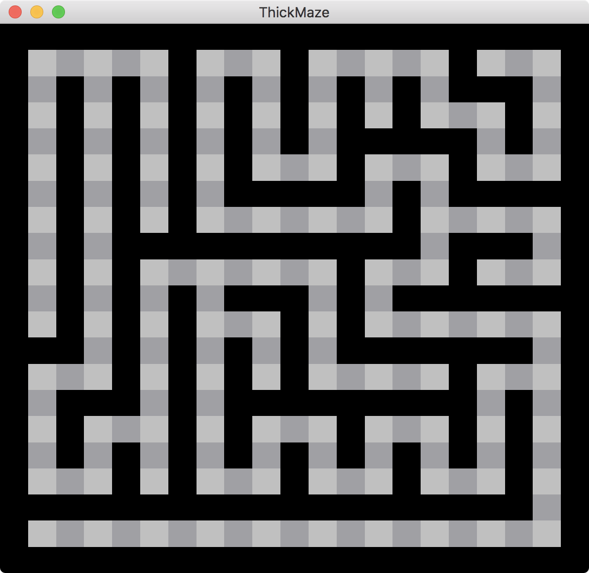
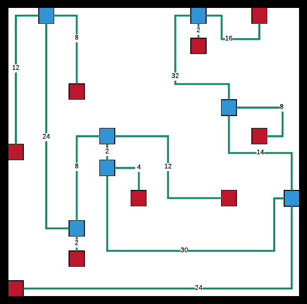

# SquashedMaze

A `SquashedMaze` is a representation of any `AbstractMaze` as a weighted graph (possibly with
loops) that preserves the basic structure of the original maze; thus, the action of mapping
a maze to a `SquashedMaze` is a [homomorphism](../typeclasses/README.md#homomorphism).

The general idea for generating a [`SquashedMaze.h`](SquashedMaze.h) is as follows:

Given a maze, first find all rooms for the maze using a [`RoomFinder.h`](RoomFinder.h). (A room is a group of four or more connected cells with
no wall segments between them.) The entrances of each room - i.e. the cells that have neighbours outside
of the room - are identified.

A dead end in a maze is a cell with only one wall missing.

A junction is a cell with at least three walls missing, i.e. a branching cell that offers a choice of
direction.

The algorithm then proceeds as follows:

1. Create a vertex `u` for each room entrance, for each dead end, and for each junction in the original maze.
For each such vertex, maintain a list of cells visited.

2. Using a queue, create an entry for each vertex along with a collection of cells visited.

3. While the queue is not empty, continue the following steps:

4. Take the entry in the front of the queue, say for vertex `u` with cells visited `C`.

5. If the las cell in `C` has any neighbouring cells that are vertices, say `v`, create a weighted
edge `{u, v}` with weight the number of moves it takes to reach `u` from `v`, i.e. the length of `C`.
(Note that in some cases, there may be more than one path from `u` to `v`, in which case, we take the
one of lowest weight.)

6. For any neighbouring cell `c` that is not a vertex, create a new entry for the queue with `C`
extended by `c`.

The primary reason for the `SquashedMaze` is to reduce the maze size dramatically while maintaining
essential structure. This will allow us to run intensive algorithms such as finding the two vertices
with the longest shortest path between them, giving an optimal start and end position for the maze.

It also allows us to generate some interesting statistics.

Here is an example of a (room-free) 19 x 19 `ThickMaze` generated by running the randomized depth-first
search algorithm to find a 10 x 10 `Maze` and then applying the homomorphism from `Maze` to
`ThickMaze`:

And here is the resulting `SquashedMaze`:

The red squares represent the dead end vertices, and the blue squares represent the junction vertices.
The lines represent the edges, labeled with their weights.

Note that the original maze had `19 * 19 = 361` cells, whereas the squashed maze has only 16 vertices:
thus, the squashed maze is only 4.4% the size of the original `ThickMaze`.