# ThickMaze

A `ThickMaze` is a maze where the walls are not simply cell dividers, but actually take up a cell themselves, i.e. each entry in the `ThickMaze` is either `FLOOR` or `WALL`. This representation allows the `ThickMaze` library to use some unique algorithms that would not be possible for the [`Maze`](../maze/README.md) library:

1. [Cellular Automata](#cellular-automata)
2. [Grid Colourings](#grid-colourings)

Additionally, all algorithms that can be used to generate `Maze`s can also be used, via homomorphism, to generate `ThickMaze`s. See the [Typeclasses](#typeclasses) section below for more information.

## Cellular Automata

`ThickMaze`s allow us to implement maze-generating _cellular automata,_ as described here:

https://en.wikipedia.org/wiki/Cellular_automaton

These are algorithms that generate a random grid of floor and walls, and then for a time `t`, use certain rules based on the contents at time `t-1` to determine the layout. A key property of the cellular automata used for mazes is that they are known to converge to relatively stable configurations quite quickly, but seldom produce connected (and thus, not perfect) mazes. They are still interesting to study, and algorithms such as [braiding](../../README.md#braid-mazes) can post-modify such mazes to increase the likelihood that they be connected.

The state of a cell at time `t` is determined by three parameters, each of which will be described below:

1. Its state at time `t-1`;
2. The neighbourhood of the cell at time `t-1`; and
3. The cellular automaton rule chosen.

The state of a cell is a binary parameter, where `true` means the cell is alive (i.e. a wall), and `false` means that the cell is not alive (i.e. a floor space).

The neighbourhood of a cell comprises the state of the cells around a given cell. The library provides implementations the two most common neighbourhood types:

1. The Moore neighbourhood, which consists of the eight squares surrounding a cell; and
2. The von Neumann neighbourhood, which also has size eight but instead consists of two tiles in each of the four cardinal directions, i.e. north, south, east, and west.

Users may additionally plug in their own customized neighbourhood functions.

A cellular automaton ruleset determines the contents of a cell at time `t` based on its state and the state of its neighbours at time `t-1`. It is usually written <code>Bb<sub>1</sub>b<sub>2</sub>...b<sub>m</sub>/Ss<sub>1</sub>s<sub>2</sub>...s<sub>n</sub></code>, with the following significance:

1. If a cell's `t-1` state is not alive and the cell had <code>b<sub>i</sub></code> neighbours at time `t-1`, then the cell is _born,_ i.e. the state changes to alive at time `t`.

2. If a cell's `t-1` state is alive and the cell had <code>s<sub>j</sub></code> neighbours at time `t-1`, then the cell _survives_, i.e. the state remains alive at time `t`.

3. Otherwise, the cell _dies_ or remains not alive at time `t`.

The current automata ruleset offered by default include:

1. `B2/S123`, which seems to show the most promise and was proposed at [1](https://english.rejbrand.se/rejbrand/article.asp?ItemIndex=421);
2. Maze aka `B3/S12345`, which performs quite poorly;
3. Mazectric aka `B3/S1234`, which produces maze-like passages;
4. Vote aka `B5678/S45678`, which produces mazes with large, cavernous spaces; and
5. Vote45 aka `B4678/S35678`, which, at a small-scale, results in mostly empty space, but on larger scales, may result in cavernous spaces.

Users may define their own cellular automata rulesets.

The grid is initialized at random, with a user-supplied probabiity (default value 0.5) of each cell starting off alive. The algorithm runs until one of two conditions are met:

1. A user-supplied maximum number of generations have passed (default value 10,000); or
2. The grid reaches a _relatively stable_ state, i.e. for a user-supplied parameter `N`, the grid repeats one of the previously seen `N` states. This indicates that the cellular automaton has either stabilized to a single state, or has reached a convergence where it cycles between a small number of states.

Here is a width 100, height 50 `ThickMaze` generated by the cellular automaton with using the Moore neighbourhood and ruleset `B2/S123`, displayed as a screenshot to reduce row interspacing. You can see that the maze is neither perfect (i.e. it has loops), nor connected (i.e. there are parts of the maze that you can't reach from other parts).

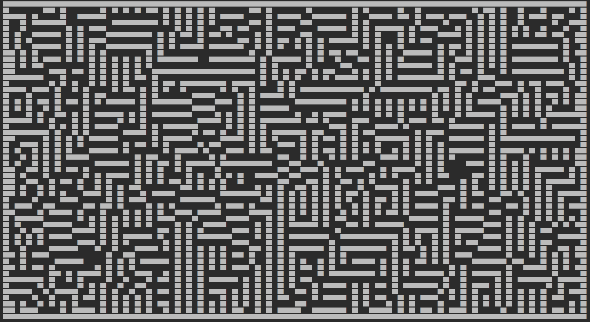

## Grid Colourings

Another strategy that can be used to generate `ThickMaze`s is a modification of the [randomized Prim's algorithm](https://en.wikipedia.org/wiki/Maze_generation_algorithm#Randomized_Prim's_algorithm) using grid colourings. The algorithm, from [2](https://www.gamasutra.com/blogs/HermanTulleken/20161005/282629/Algorithms_for_making_more_interesting_mazes.php), is detailed here.

The key idea in the randomized Prim's algorithm is as follows:

```math
Pick any cell C at random and mark it visited
Set the list L to the walls of C
while (L is not empty)
   Pick a wall W at random from L
   If W has one end to a cell C' not yet marked, mark C' and carve a passage for W
```

The end result will be a perfect maze.

In this variant of the randomized Prim's algorithm, assume that we are generating a maze of width `w` and height `h`. We will illustrate with an example of the process at each step. In the example, let `w = 24` and `h = 16`.

Then select three integer parameters:
* <code>0 &lt; u<sub>x</sub> &lt; w</code>;
* <code>0 &lt;= v<sub>x</sub> &lt; w</code>; and
* <code>0 &lt; v<sub>y</sub> &lt; h</code>.

In our example, we choose:
* <code>u<sub>x</sub> = 4</code>
* <code>v<sub>x</sub> = 2</code>
* <code>v<sub>y</sub> = 2</code>

Let `G` be a grid of width `w` and height `h`, and let `G[x][y]` indicate the cell in the `x`th column and `y`th row of `G`.

The algorithm begins by producing a _periodic colouring_ of the cells of `G` using <code>K = u<sub>x</sub> * v<sub>y</sub></code> colours. This is done by defining a _colour lookup table_ `T` with:
* <code>T<sub>c</sub> = v<sub>x</sub></code> columns; and
* <code>T<sub>r</sub> = K / gcd(v<sub>x</sub>, v<sub>y</sub></code> rows

where `gcd(a,b)` is the _greatest common divisor_ of `a` and `b`.

Over the first <code>K / v<sub>x</sub></code> rows of `T`, assign a unique colour to each cell. Then, for the remaining rows of `T`, we let:

<code>T[x][y] = T[(x - v<sub>x</sub>) % T<sub>c</sub>][(y - v<sub>y</sub>) % T<sub>r</sub>]</code>

where `%` is the modulo operator so that `c = a % b` has the property that `0 <= c < b` and there is some integer `p` such that `p * b + c = a`.

This defines a colouring over all of the cells of our grid `G`, where we assign to cell `G[x][y]` the colour:

<code>G[x][y] = T[x % T<sub>c</sub>][y % T<sub>r</sub>]</code>.

The idea here is that we have two vectors, <code>u = (u<sub>x</sub>, 0)</code> and <code>v = (v<sub>x</sub>, v<sub>y</sub>)</code> so that cells that differ by any linear combination of `u` and `v` have the same colour, hence the term *periodic*.

This is easier illustrated through example. Here is the colouring of our 24 by 16 grid using `K = 4 * 2 = 8` colours, with position `(0,0)` being in the upper-left corner. The lookup table has size:

* <code>T<sub>r</sub> = 4</code>
* <code>T<sub>c</sub> = 8 / gcd(2, 2) = 8 / 2 = 4</code>

and is shown by the area bounded by the black box.

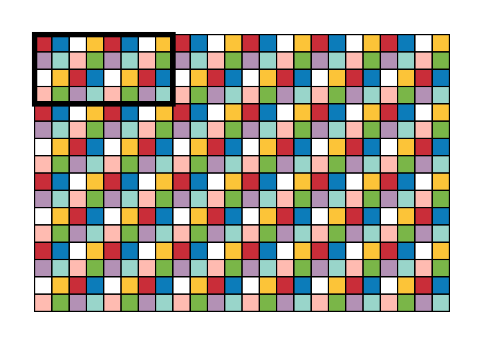

Now, pick any colour `c` (in our example, white) to be the _rooms_ of the maze. In the randomized Prim's algorithm, the walls are single cells. The idea in this modification is to instead allow walls to assume different shapes consisting of one or more contiguous cells. We do this as follows: find a partition of the remaining `K-1` colours into two or three partition classes, say `{W<sub>1</sub>, W<sub>2</sub>}` or `{W<sub>1</sub>, W<sub>2</sub>, P}` subject to the properties below. The idea is that `W<sub>1</sub>` will represent one wall type, `W<sub>2</sub>` will represent another wall type, and `P` will represent the _pillars_ of our maze (i.e. fixed walls).

1. <code>W<sub>1</sub></code> and <code>W<sub>2</sub></code> are both nonempty. (Note that `P` can be empty.)
2. The colours of <code>W<sub>1</sub></code> must be contiguous.
3. The colours of <code>W<sub>2</sub></code> must be contiguous.
3. A room (with exceptions for the borders) must be adjacent to exactly four walls.
4. A wall (with exceptions for the borders) must be adjacent to exactly two rooms.
5. A wall is adjacent to a room if and only if a room is adjacent to a wall.

In our example above, we pick the following partition:

1. <code>W<sub>1</sub></code> is purple, cyan, and peach (i.e. the first three colours in the second row).
2. <code>W<sub>2</sub></code> is yellow, green, and blue (i.e. the first three colours in the fourth column).
3. `P` is red.

Now that we have a partition of the colours, we can treat all the colours in a partition class as being the same since they represent either a wall or a pillar. In our example, we will replace the colours of <code>W<sub>1</sub></code> all with peach, and the colours of <code>W<sub>2</sub></code> all with green, while the pillars will (for now) remain red. Here is the resulting grid:


You can see here that, except around the border, where there are incomplete walls:

1. The peach cells represent one "wall", and the green cells represent another "wall", while the red cells represent pillars.
2. Each room not near the border is adjacent to exactly four walls: two green walls and two peach walls.
3. Except around the border, each green wall separates exactly two rooms, and each peach wall separates exactly two rooms.

Now, in order to avoid partial walls and rooms on the border of the grid (which we don't want to allow), we make all of these into pillars. To make this distinction clearer, we colour all of the pillars black:

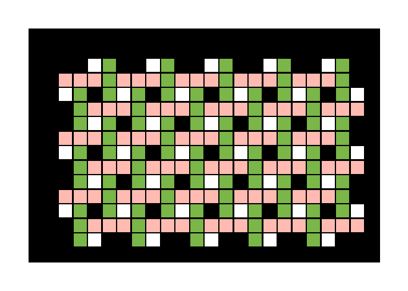

Now we can proceed as usual with the randomized Prim's algorithm. We pick a cell at random, indicated by the light yellow cell in this image, and add the four walls around it (two peach and two green) to our wall list. Walls currently in our wall list will be indicated in cyan. As we build our maze, we will continue to colour the visited cells and carved walls light yellow.

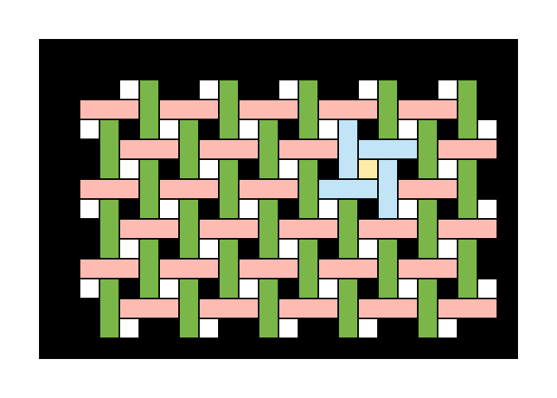

We now continue to iterate over our list of walls, picking walls that connect a room that is already part of the maze to a room that is not yet in the maze, and remove them. Here, we pick the wall to the west of our initial cell:

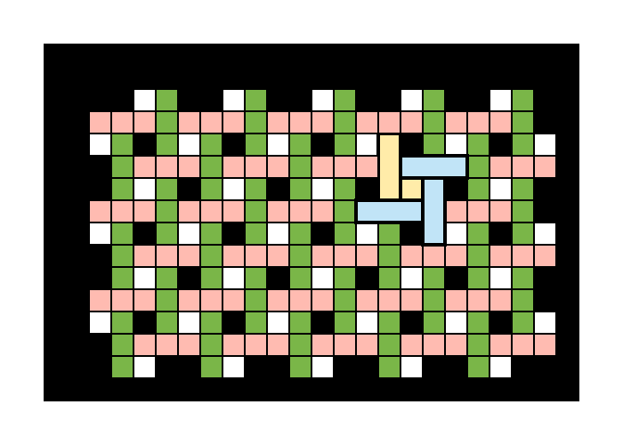

We add this wall and its connecting cell to our light yellow maze, and then add the walls around this cell to our cyan cell list:

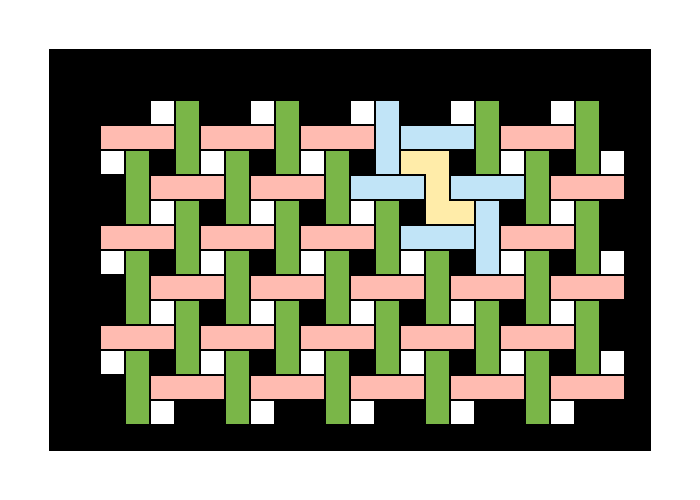

We continue this process, randomly selecting walls, until our wall list is empty, which gives us a maze:

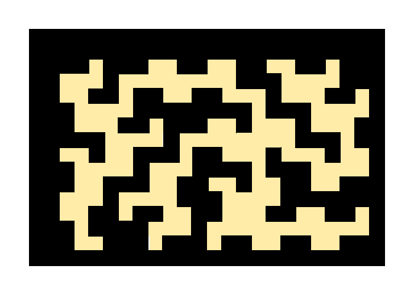

There are important things to realize about this algorithm:

1. The resultant maze will always be connected, but it may not be perfect (i.e. it may have loops).
2. The resultant maze may be degenerate.

Here are some examples of mazes generated using this technique:

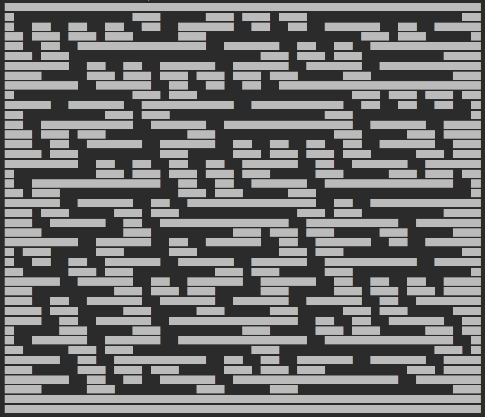

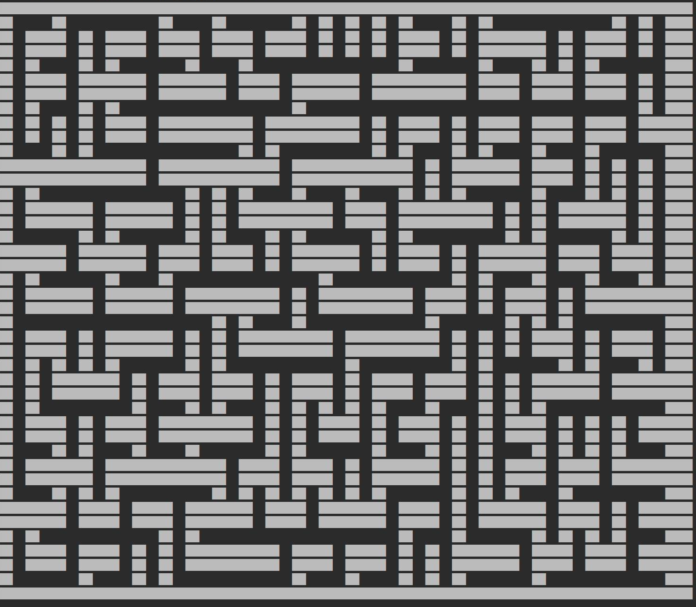

Here is an example with loops:

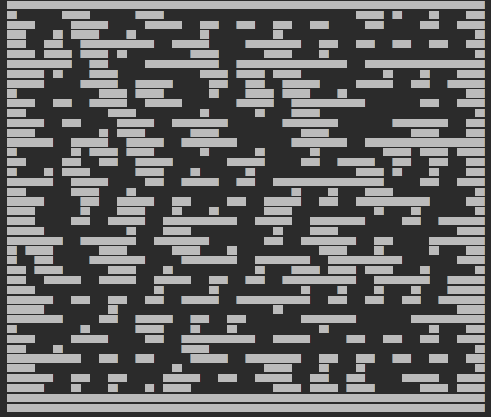

Here is a degenerate example:

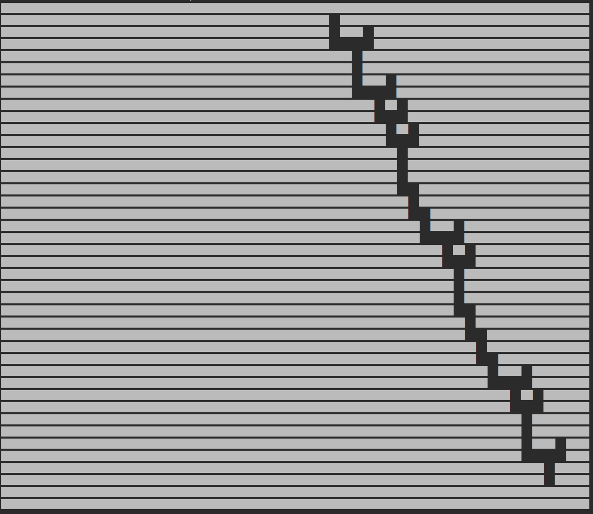

Indeed, Prim's algorithm, for thick mazes, is simply the application of this algorithm for <code>u<sub>x</sub> = 2</code>, <code>v<sub>x</sub> = 0</code>, <code>v<sub>y</sub> = 2</code>, which gives this colouring. The green and the blue cells are the walls, and the red cells are the pillars.

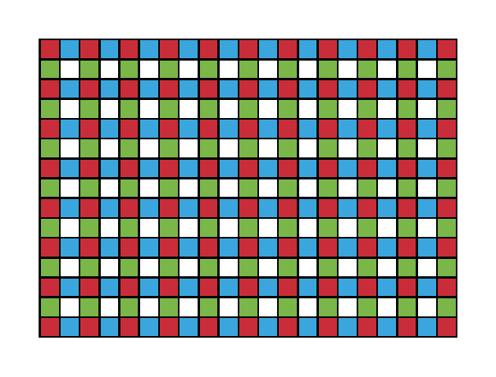

## Typeclasses

For the definition of homomorphisms and related concepts, see [Homomorphisms](../../README.md#homomorphisms) on the main page.

There is a homomorphism (specifically, a monomorphism) from regular `Maze`s to `ThickMaze`s. In other words, every `Maze` can be represented as a `ThickMaze` with the same structure, but not the converse, i.e. there are `ThickMaze`s that cannot be represented as `Maze`s.

This is useful, as it means that every algorithm that generates `Maze`s can also generate `ThickMaze`s via the homomorphism.

Here's an example of a 25 by 20 randomizd depth-first search `Maze`:

```
┌───────┬───────────────────┬─────────┬─────┬─────┐ 
│ ╶─┬─┐ └───────────╴ ┌───╴ │ ╶─────┐ ╵ ╶─┐ ╵ ╶─┐ │ 
│ ╷ │ └─╴ ┌─────┐ ┌───┤ ╶─┬─┘ ┌─────┤ ┌───┼───┬─┘ │ 
├─┘ ├─────┘ ┌─┐ └─┘ ╷ └─┐ └───┘ ┌─┐ └─┤ ╷ ╵ ╷ ╵ ╷ │ 
│ ╶─┤ ╶─────┘ └─┬───┴─┐ ├───┬───┘ └─┐ │ ├───┴─┬─┘ │ 
│ ╷ └─────┬───╴ │ ╷ ┌─┘ │ ╶─┘ ╶─┐ ╶─┘ ╵ │ ┌─╴ │ ╶─┤ 
│ │ ╶─┬─╴ │ ╶───┤ │ │ ╶─┴─┬─────┼───┬───┤ └─┬─┴─┐ │ 
│ ├─┐ │ ┌─┴───┐ │ │ └───┐ │ ╶─┐ ╵ ╷ └─┐ ╵ ╷ │ ╷ ╵ │ 
│ │ │ │ ╵ ┌─╴ │ ╵ ├─╴ ┌─┘ └─┐ ├───┴─┐ └───┤ ╵ ├───┤ 
│ ╵ │ ├─┬─┘ ┌─┴───┤ ┌─┤ ┌───┘ │ ┌───┴───╴ │ ┌─┴─┐ │ 
├───┘ │ ╵ ╶─┴───╴ │ ╵ │ │ ╶───┘ │ ┌─┬─────┤ ╵ ╷ ╵ │ 
│ ┌───┴───────┬─╴ │ ┌─┘ ├───┬─╴ │ ╵ ├───╴ ├───┴─╴ │ 
│ ╵ ╶───┬───╴ ├───┘ │ ╷ ╵ ┌─┘ ┌─┴─┬─┘ ╶───┘ ┌─────┤ 
├───┬───┘ ┌─╴ │ ┌───┤ ├─╴ │ ┌─┘ ┌─┘ ┌───┬───┴─╴ ╷ │ 
│ ╷ ╵ ┌───┤ ┌─┘ │ ╷ │ └───┘ │ ╶─┘ ┌─┘ ╷ ╵ ╷ ┌───┤ │ 
│ └─┬─┘ ╷ ╵ │ ┌─┘ │ └───────┤ ╶───┴───┤ ╶─┤ │ ╶─┤ │ 
│ ╷ └─┬─┴─┐ │ │ ┌─┴───────╴ ├───────┐ │ ┌─┘ ├─╴ │ │ 
│ ├─┐ │ ╷ └─┤ ├─┘ ┌─╴ ┌───┐ │ ┌─┐ ╶─┘ ├─┘ ┌─┘ ╷ │ │ 
│ ╵ │ ╵ ├─╴ │ │ ╷ ├───┘ ╷ └─┤ ╵ └─────┘ ┌─┴─╴ │ │ │ 
├─╴ └───┤ ╶─┘ │ └─┘ ╶───┴─┐ └───────────┘ ╷ ╶─┴─┘ │ 
└───────┴─────┴───────────┴───────────────┴───────┘ 
```

Here is the `ThickMaze` with the same structure as obtained by the homomorphism:


Additionally, there is `Show` typeclass for `ThickMaze`s that was used to generate the string representation as seen in the previous example.

## Citations

1. [Cellular automaton maze generation - Andreas Rejbrand’s Website](https://english.rejbrand.se/rejbrand/article.asp?ItemIndex=421)

2. [Gamasutra: Herman Tulleken's blog - Algorithms for making more interesting mazes](https://www.gamasutra.com/blogs/HermanTulleken/20161005/282629/Algorithms_for_making_more_interesting_mazes.php)

[Back to top](#thickmaze)
