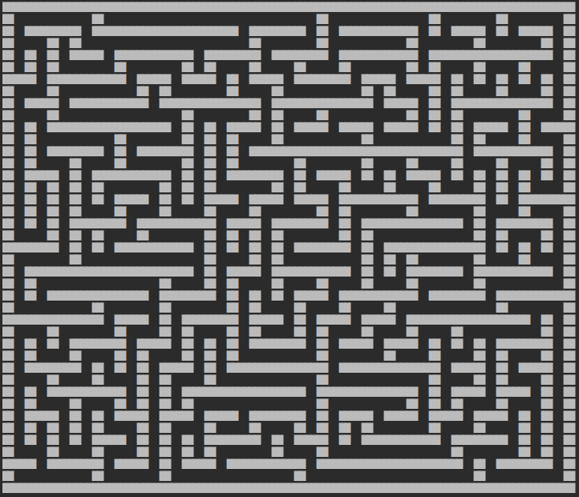
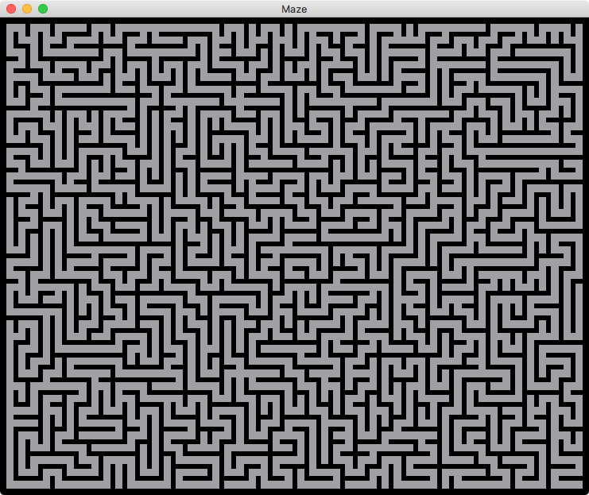
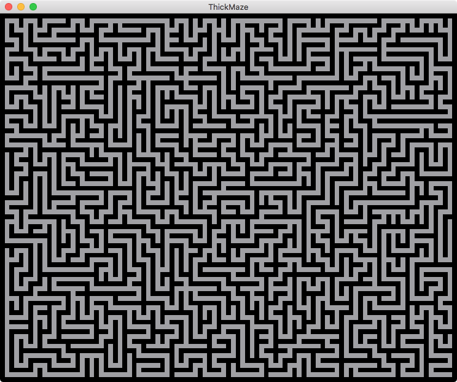
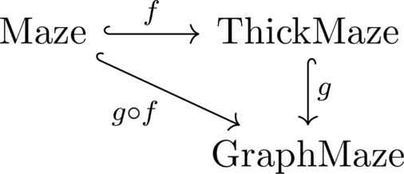

# TypeClasses

A typeclass is an interface that defines some behaviour.
The `spelunker` library offers two typeclasses, namely:

1. [Show](#show)
2. [Homomorphism](#homomorphism)

# Show

The `Show` typeclass defines the behaviour to take a type and produce a `std::string` representation
of it.

`spelunker` provides implementations of `Show` for a number of different classes to display things such
as `Direction`, `Dimensions2D`, `Maze`, and `ThickMaze`.

Here is an example of a width 50, height 40 maze generated by the [randomized depth-first search algorithm](../src/maze/README.md#randomized-depth-first-search), represented
as a string via the following code:

```
#include <spelunker/typeclasses/Homomorphism.h>
#include <spelunker/maze/Maze.h>
#include <spelunker/maze/DFSMazeGenerator.h>
#include <spelunker/maze/MazeTypeclasses.h>
using spelunker;

int main() {
    maze::Maze m = maze::DFSMazeGenerator{50, 40}::generate();
    std::cout << typeclasses::Show<maze::Maze>::show(m);
}
```

produces the following string output:

```
┌───────┬───────────┬───────────┬───────────┬───┬───────────┬─────┬─────────┬─────────┬───────┬─────┐
│ ╶─┐ ╷ ╵ ┌───┬─╴ ┌─┘ ╷ ╶─┬─────┘ ┌───┐ ┌─┐ ╵ ╷ │ ╶─┐ ┌───┐ ╵ ┌───┘ ╷ ┌───╴ │ ╷ ╶─┬─╴ │ ┌─┬─╴ │ ┌─┐ │
├─┐ │ └─┬─┘ ┌─┘ ┌─┘ ┌─┼─╴ │ ╶───┬─┘ ╷ │ │ └───┘ └───┘ │ ╷ ├───┤ ╶───┤ └─────┘ ├─╴ │ ╶─┘ │ │ ╶─┤ │ ╵ │
│ ╵ └─┐ │ ╷ │ ╶─┤ ┌─┘ │ ╶─┴───┐ ╵ ┌─┤ │ └───┐ ┌─────┐ │ │ ╵ ╷ └─╴ ┌─┴─────┐ ╶─┤ ┌─┴───┬─┘ └─┐ │ ├───┤
│ ┌─┬─┘ │ ├─┴─┐ │ ╵ ╷ └─┬─┐ ╶─┴───┘ │ ├───┐ └─┤ ┌─┐ ├─┘ └─┬─┴─────┘ ┌───┐ │ ┌─┘ │ ╶─┐ │ ┌─╴ │ │ ╵ ╷ │
│ │ │ ┌─┤ ╵ ╷ ╵ ├─┬─┴─┐ │ └───┬─╴ ┌─┘ ├─╴ └─┐ ╵ ╵ │ ╵ ┌───┘ ┌───────┘ ╷ ╵ └─┘ ┌─┴─╴ │ │ ├───┤ └─┐ │ │
│ │ │ │ │ ╶─┴───┘ │ ╷ │ └─╴ ┌─┘ ┌─┘ ┌─┘ ┌─┐ └───┬─┴─┬─┘ ╷ ┌─┴─┐ ┌───┬─┴─┬─╴ ┌─┘ ┌───┤ │ ╵ ╷ └─╴ │ │ │
│ ╵ │ │ ╵ ┌───────┘ │ └─┬─╴ │ ╶─┘ ┌─┘ ┌─┘ └───┐ │ ╷ ╵ ╷ ├─┘ ╷ ├─┘ ╷ ╵ ╷ └─┐ │ ┌─┘ ╷ │ ├───┴───┐ │ │ │
│ ┌─┘ │ ╶─┤ ┌───────┤ ╷ │ ╶─┼─────┘ ┌─┘ ╷ ┌─╴ │ │ └─┬─┘ │ ┌─┤ ╵ ╶─┼───┤ ╷ │ │ └───┤ │ │ ┌───╴ │ └─┘ │
│ │ ┌─┴───┤ └─┐ ╷ ┌─┘ ├─┴─╴ │ ╷ ┌───┴─┐ │ └─┐ │ └─┐ └─┐ │ │ └─┬───┘ ╷ └─┘ ├─┴───╴ ╵ │ ╵ │ ╶───┼───╴ │
│ │ ╵ ┌─╴ ├─┐ └─┤ │ ╶─┤ ╶───┴─┤ ╵ ┌─╴ ├─┴─┐ └─┴─╴ ├─╴ │ │ │ ╶─┤ ╶─┬─┴─┬───┘ ╶─┬─────┴─┐ ├───┐ │ ╶───┤
│ ├───┘ ╷ ╵ ├─┐ ╵ ├─╴ ├─────┐ │ ╶─┤ ╷ │ ╷ │ ╶─────┤ ┌─┘ │ └─╴ └─┐ ╵ ╷ ╵ ╶─┬───┴─────╴ │ └─┐ │ └─┬─╴ │
│ │ ┌───┴─┐ │ └─┐ │ ╶─┤ ┌─┐ │ ├─╴ │ └─┘ │ └─┬───┐ │ └─┐ └───┐ ┌─┴───┤ ┌─┬─┘ ┌───────┬─┴─┐ ╵ ├─╴ ├───┤
├─┘ │ ╶───┘ ╵ ╷ │ └─┐ │ │ │ │ └───┴─┐ ╶─┴─┐ │ ╶─┘ └─┐ │ ┌───┘ │ ┌─┐ │ ╵ │ ┌─┘ ┌─┐ ┌─┘ ╷ └─┐ │ ╶─┘ ╷ │
│ ┌─┘ ┌───────┴─┴─┐ │ ╵ │ │ └───┬─╴ ├───┐ │ └───────┤ └─┘ ┌───┘ │ │ └───┤ │ ╶─┘ │ ╵ ┌─┤ ╶─┘ └─┬───┤ │
│ │ ╶─┤ ╶───┬─┬─╴ │ └─┬─┘ │ ╶─┐ │ ╶─┘ ╷ │ ├─────┬─┐ └─┬───┘ ┌───┤ └───┐ ╵ ├───┐ ├───┘ └─────┬─┘ ╷ ╵ │
│ └───┴───┐ │ │ ╷ ├─╴ ╵ ╷ ├─╴ │ └─┬───┤ │ ╵ ┌─╴ ╵ └─┐ │ ╶─┬─┘ ╷ └───╴ └─┬─┤ ╷ │ ├─────╴ ╷ ┌─┘ ┌─┼─╴ │
│ ┌─────┐ ╵ │ │ └─┤ ╶─┬─┴─┘ ┌─┴─╴ └─╴ │ └─┬─┘ ┌─────┘ ├─╴ │ ┌─┼───────┐ │ ╵ │ ╵ │ ┌─────┤ │ ┌─┘ │ ╶─┤
│ └─╴ ╷ └───┤ ├─╴ ├─╴ │ ╶───┴───┬─┬─╴ ├─╴ ├───┘ ┌───┐ │ ╶─┘ │ ╵ ╶─┐ ╶─┤ └─┐ └───┘ │ ┌─┐ ╵ │ │ ╶─┴─╴ │
├───┬─┴───┐ ╵ │ ╶─┤ ┌─┴───┬─┬─╴ │ ╵ ╶─┤ ┌─┘ ╶───┤ ╶─┤ ├───┬─┴───┐ └─┐ └─┐ └─┬─────┤ │ └───┤ └─┬─────┤
│ ╷ │ ╶─┐ └─╴ ├─┐ ╵ │ ╶─┐ ╵ │ ╶─┴─┬───┤ └───┬─╴ │ ╷ ╵ │ ╶─┘ ╷ ╷ └─┬─┘ ╷ └─┐ └─┐ ╷ │ └─┐ ╷ ├─╴ │ ╶─┐ │
│ │ └─╴ ├─────┘ └───┴─┐ └─┐ ├───┐ ╵ ╷ ├───┐ ╵ ┌─┤ └───┴─────┘ ├─┐ │ ┌─┴───┴─┐ │ └─┴─╴ ╵ │ │ ╷ ├─╴ │ │
│ ├─────┴───╴ ┌─────┐ │ ╷ └─┤ ╷ └───┤ ╵ ╷ └───┘ ├─────────────┤ ╵ │ ╵ ┌─╴ ╷ │ └───────┐ ├─┘ ├─┘ ┌─┘ │
│ └─┐ ┌───────┤ ╶─┐ ╵ │ └─┐ ╵ ├───┐ ├───┴───┐ ╶─┘ ╷ ┌───┬───╴ │ ┌─┴───┤ ┌─┘ └───────┐ ├─┘ ╷ │ ┌─┤ ╶─┤
├─┐ ╵ │ ┌───┐ └─┐ └─┬─┘ ┌─┴─┐ ╵ ╷ │ ╵ ╷ ╶─┐ ├─────┤ │ ╶─┤ ╶───┤ ╵ ┌─┐ ╵ ├───────┬───┘ │ ╶─┴─┘ ╵ ├─╴ │
│ └───┘ │ ╷ └─╴ ├─╴ │ ╶─┤ ╷ ├───┤ └───┴─┐ │ ├─╴ ╷ │ │ ╷ └─╴ ┌─┴───┘ ╵ ┌─┘ ┌───┐ ╵ ┌───┴─────────┘ ┌─┤
│ ┌─┐ ╶─┤ └─┬───┘ ┌─┘ ┌─┘ │ │ ╶─┴─╴ ┌───┘ │ │ ╶─┴─┤ │ └─┬───┘ ┌───────┘ ┌─┘ ╷ └───┘ ┌─────────┬───┘ │
│ │ ├─╴ │ ┌─┘ ┌───┴───┘ ┌─┤ └───┬───┤ ┌───┤ └───╴ │ ├─╴ │ ┌───┤ ┌───────┴─┐ └───┐ ╶─┤ ╷ ┌───┐ │ ╶─┐ │
│ │ │ ╶─┤ │ ╶─┴───╴ ┌───┘ └───┐ ╵ ╷ ╵ │ ╷ └─────┐ │ │ ┌─┘ ├─╴ │ ├─────╴ ╷ ├───╴ ├─╴ │ │ │ ╷ │ ├─╴ │ │
│ │ └─┐ └─┴─────┬───┘ ╶───┬─┐ ├───┴───┴─┘ ╷ ┌───┤ │ │ │ ┌─┘ ╷ │ ╵ ┌─┬───┤ └─┬───┤ ┌─┘ ├─┘ │ └─┤ ┌─┘ │
│ ╵ ╷ ├───┐ ┌─╴ │ ╶─┬───┐ │ ╵ └─╴ ┌───────┴─┘ ╷ ╵ │ └─┘ │ ╷ │ └─┬─┘ ╵ ╷ └─┐ │ ╷ │ └─┐ ╵ ┌─┴─┐ ╵ │ ╶─┤
├───┤ └─╴ │ └─┐ ├─╴ ├─╴ │ └───────┘ ┌─────────┼───┴─────┴─┘ ├─┐ │ ╶───┼─╴ │ ╵ │ └─┐ │ ╶─┴─╴ └─┬─┴─┐ │
├─╴ ├───┐ └─┐ │ │ ┌─┘ ╷ └───┬─────┬─┴─────┐ ╷ └───┐ ┌───┬───┘ │ └───┐ │ ╷ └───┼─╴ │ └─┬─┬───╴ └─╴ │ │
│ ┌─┘ ╷ ╵ ┌─┘ │ │ ╵ ┌─┴───┐ │ ╶───┘ ╷ ┌─┐ ╵ ├───┐ ╵ │ ┌─┘ ╷ ╶─┴───┐ │ │ │ ┌───┘ ┌─┴─╴ │ ╵ ┌───────┘ │
│ ╵ ┌─┴───┘ ┌─┴─┴───┘ ┌───┤ │ ┌─────┘ │ └───┘ ┌─┴───┤ ╵ ┌─┴───┐ ┌─┘ │ │ └─┤ ┌───┤ ╶───┴───┤ ┌─────┐ │
│ ╶─┤ ╷ ┌───┘ ┌───┐ ╶─┤ ╷ │ └─┤ ┌─────┘ ╶─────┤ ╷ ╶─┘ ┌─┘ ┌─╴ │ │ ╶─┴─┤ ╷ │ │ ╶─┘ ┌─┬───╴ │ │ ┌─┐ ╵ │
├───┘ │ │ ╶───┘ ╷ ├─┐ ╵ │ └─╴ │ └───┐ ╶───┬─┐ │ ├─────┴─╴ │ ╶─┤ └─┬─┐ └─┤ │ │ ╶───┘ │ ┌───┘ │ │ └───┤
│ ╶───┴─┴───┬───┤ ╵ └───┴─┬───┘ ┌─╴ ├───┐ │ │ ╵ │ ╶─────┬─┴─┐ │ ╷ ╵ └─┐ ╵ │ └─┬───┬─┘ │ ╶─┐ │ ├───╴ │
│ ┌───┐ ┌─╴ │ ╷ ├───────┐ └─────┤ ┌─┘ ╷ │ ╵ ├───┴───┬─╴ │ ╶─┘ │ │ ┌───┴─┐ └─┐ ╵ ╷ ╵ ┌─┴─╴ │ │ ╵ ┌─┐ │
│ ╵ ╷ │ └───┘ │ ╵ ╶─┐ ╶─┴─────╴ ╵ │ ╷ └─┴─╴ └─╴ ┌─╴ ╵ ┌─┘ ╶───┤ └─┘ ╷ ╶─┴─╴ └───┴───┴─────┘ ├───┘ ╵ │
└───┴─┴───────┴─────┴─────────────┴─┴───────────┴─────┴───────┴─────┴───────────────────────┴───────┘
```


Here is an example of a 50 by 40 thick maze, produced by the [randomized depth-first search algorithm](../src/maze/README.md#randomized-depth-first-search):

```
#include <spelunker/typeclasses/Homomorphism.h>
#include <spelunker/maze/DFSMazeGenerator.h>
#include <spelunker/thickmaze/ThickMaze.h>
#include <spelunker/thickmaze/ThickMazeGeneratorByHomomorphism.h>
#include <spelunker/thickmaze/ThickMazeTypeclasses.h>

using spelunker;

int main() {
    thickmaze::ThickMaze m = thickmaze::ThickMazeGeneratorByHomomorphism<maze::DFSMazeGenerator>{
        maze::DFSMazeGenerator50, 40})::generate();
    std::cout << typeclasses::Show<thickmaze::ThickMaze>::show(m);
}
```



# Homomorphism

This section is mathematical but useful for maximizing the value of graph generation algorithms: read at your own risk.

As mazes are essentially certain families of graphs (trees in the case of perfect mazes), we can discuss _homomorphisms_ between different classes of graphs. Some basic definitions:

1. A _graph_ is a mathematical structure `G = (V,E)`, where `V` is a set of vertices (or points), and `E` is a set of edges (or lines), each connecting two vertices. A _maze_ can be thought of as a type of graph where the cells are vertices and the passages between cells are edges.

1. A _homomorphism_ is a structure-preserving map: if we have two graphs, `G` and `H`, then a homomorphism `φ` is a map from the vertices of `G` to the vertices of `H` so that if there is an edge between two vertices in `G`, say `(v, w)`, then there is also an edge between the vertices `(φ(v), φ(w))` in `H`.

   This is important because we have a homomorphism from `Maze` to `ThickMaze`, which permits the use of any of the `Maze`-specifc generation algorithms to also be used to generate `ThickMaze`s. You can read more about this homomorphism [here](src/thickmaze/README.md#typeclasses).

2. A homomorphism is called a _monomorphism_ if the map `φ` is _one-to-one_ or _injective_, meaning that if `φ(v) = φ(w)`, then `v = w`.

   The homomorphism from `Maze` to `ThickMaze` is an example of a monomorphism.

3. A homomorphism is called an _epimorphism_ if the map `φ` is _onto_ or _surjective_, meaning that for every vertex `w` in a graph `H`, there is at least one vertex `v` in `G` such that `φ(v) = w`.

4. An _isomorphism_ is a homomorphism that is both a monomorphism and an epimorphism, aka a bijective homomorphism. Two things that are _isomorphic_ have identical structure, and thus may be considered, for all intents and purposes, the same object.

To show the power of homomorphisms, here is an example of a 25 by 20 `Maze` generated by the [hunt-and-kill algorithm](src/maze/README.md#hunt-and-kill):



Using the monomorphism from `Maze` to `ThickMaze`, we get a `ThickMaze` with the same structure:




Finally, here is a commutative diagram of the relationships between the different subclasses of `AbstractMaze`, where the arrows represent monomorphisms:


